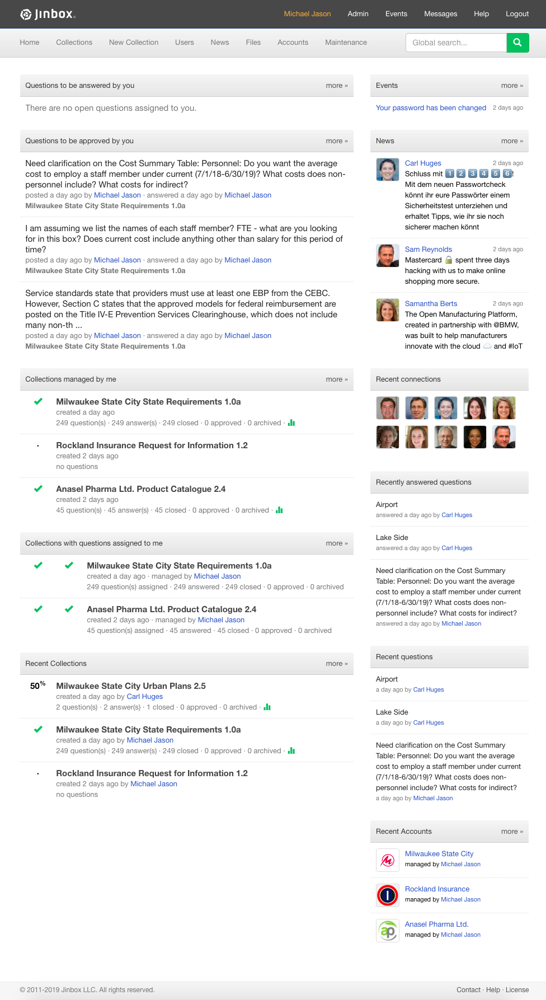
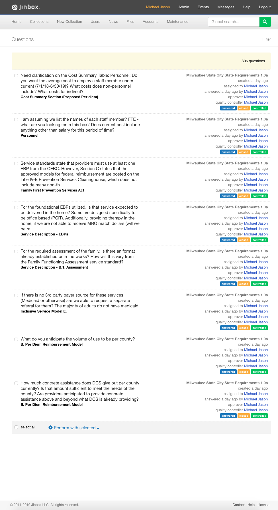
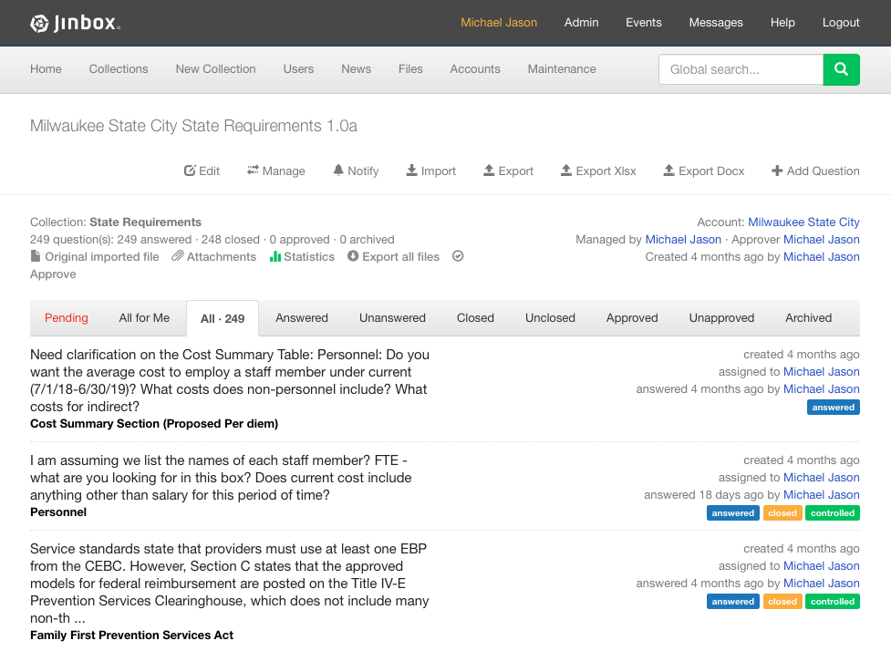
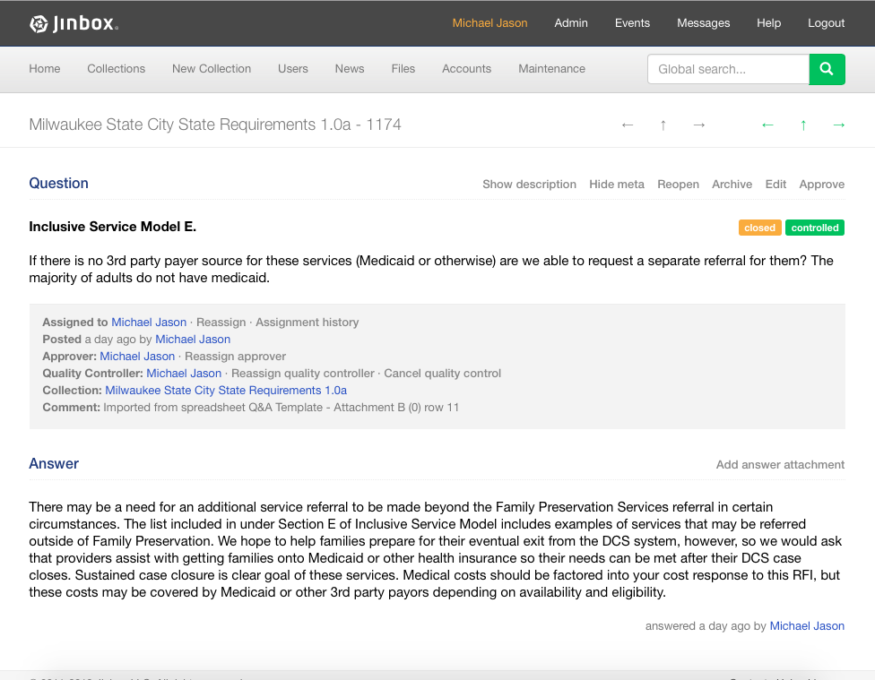
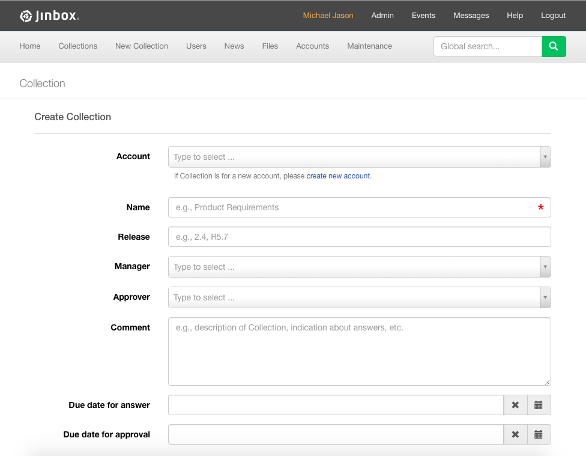
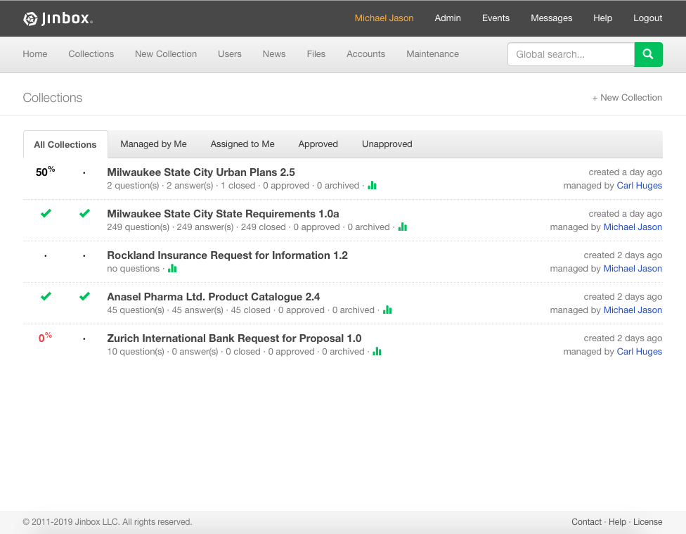
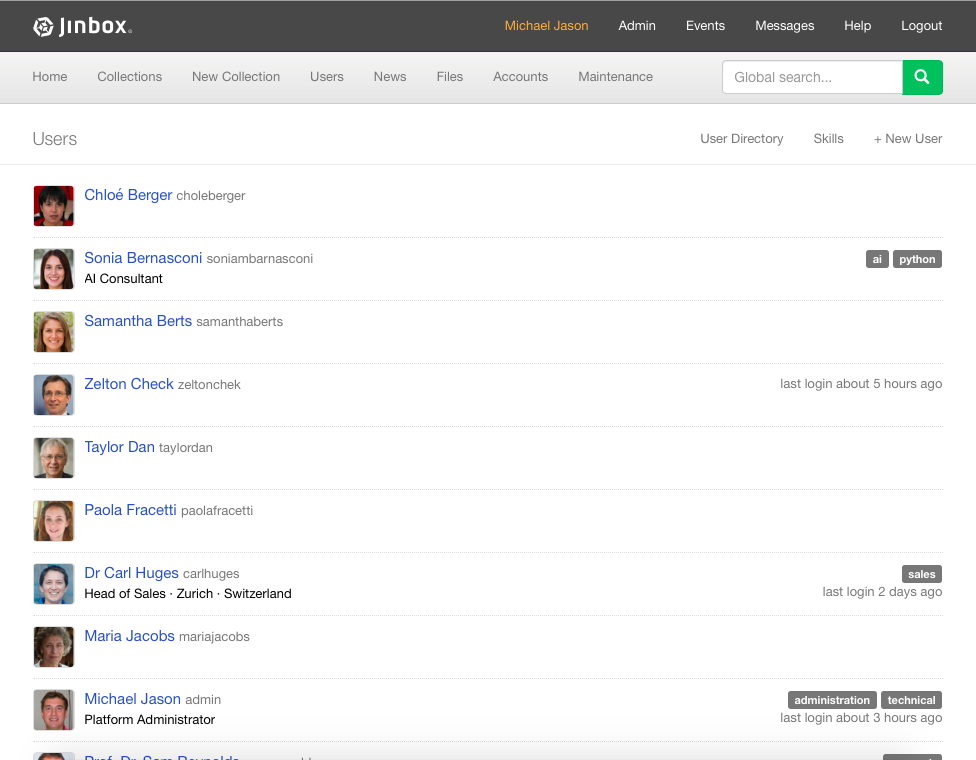
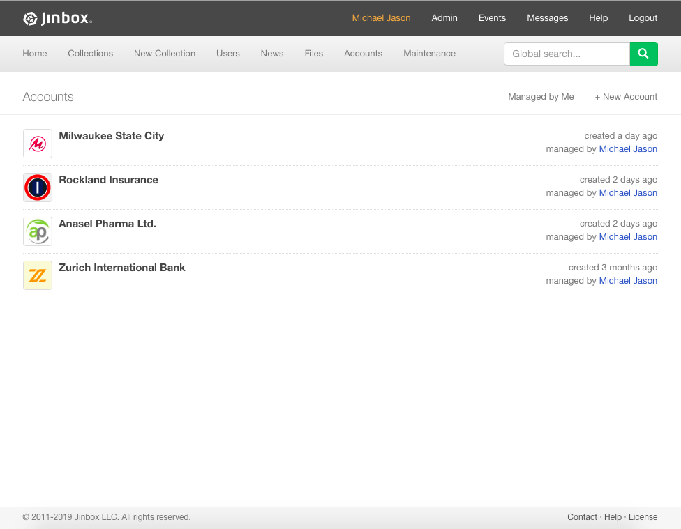
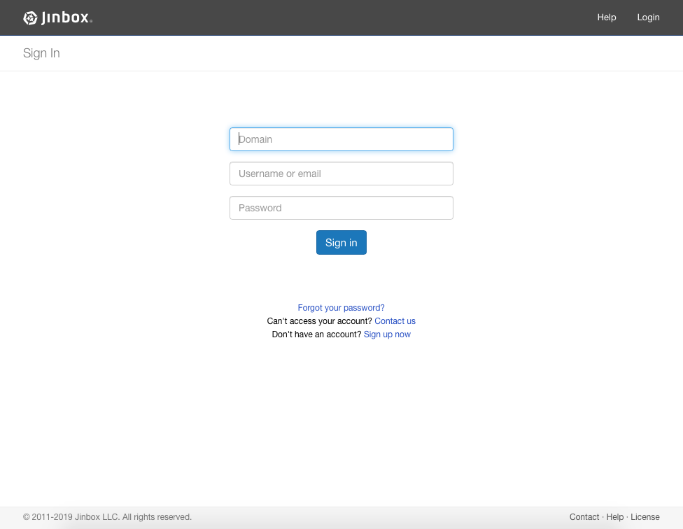
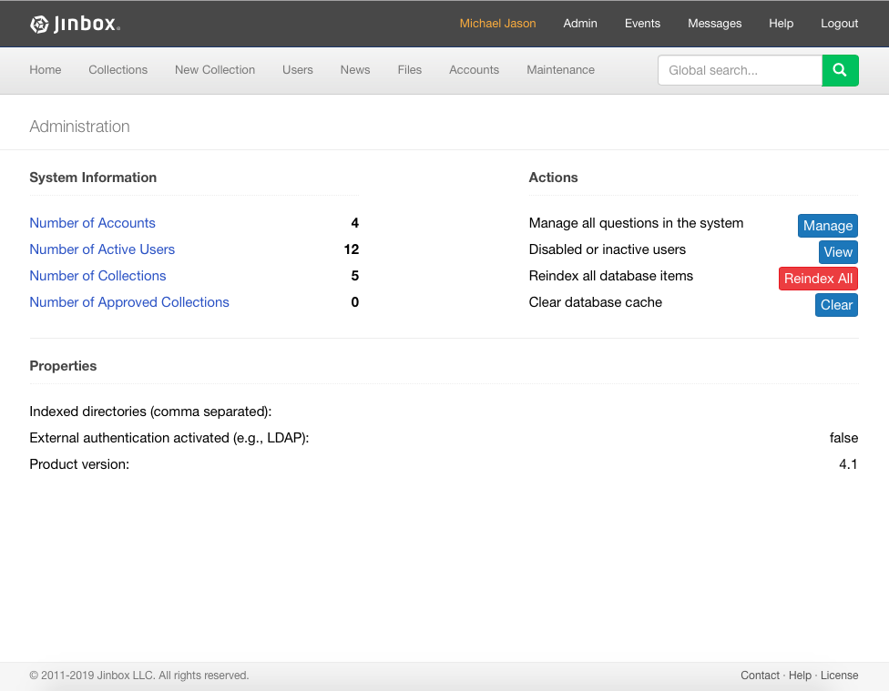

<h1>Knowledge Management Platform</h1>

Code in private repository

Demo: http://app.jinbox.com (it may take some time to load the first time due to the server activation)

<h2>UI Screenshots</h2>
<table>
  <tr>
    <td valign="top"></td>
    <td v></td>
  </tr>
   <tr>
    <td valign="top"></td>
    <td valign="top"></td>
  </tr>
  <tr>
    <td valign="top"></td>
    <td valign="top"></td>
  </tr>
  <tr>
    <td valign="top"></td>
    <td valign="top"></td>
  </tr>
  <tr>
    <td valign="top"></td>
    <td valign="top"></td>
  </tr>
</table>
